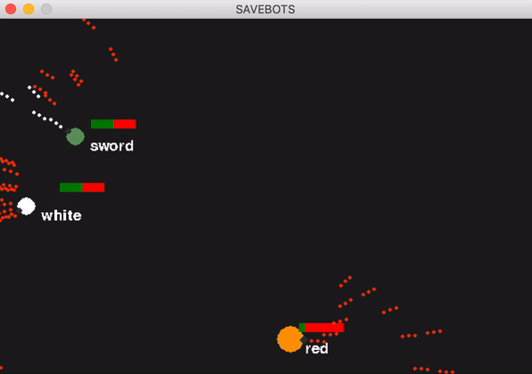

# Savebots

**savebots** is a python version of the programming game crobots.
Read the [Wiki](https://en.wikipedia.org/wiki/Crobots) for more detailed information about the game.

Thats the project structure:
* [src/](#/src)
   * [actions/](#src/actions)
      * [collision.py](#src/actions/collision.py)
      * [frame.py](#src/actions/frame.py)
      * [shooting.py](#src/actions/shooting.py)
   * [elements/](#src/elements)
      * [core.py](#src/core.py)
      * [lasers.py](#src/lasers.py)
   * [robots/](#src/robots)
      * yaml file for bots configuration
   * [utils/](#src/utils)
      * [check.py](#src/utils/check.py)
      * [parsing.py](#src/utils/parsing.py)
   * [main.py](#src/main.py)
* [img](#/img)
   * img source for the readme

## Install 🚀

### Prerequisites

**Python 3.6** is required for playing, you can install it from [here](https://www.python.org/downloads/).

### On Linux/MAC OS

After downloading the repository, open the terminal and go in the root directory.

      cd savebots

Then execute the command:

      sh run.sh

The bash script automatic install the dependencies on requirements.txt and run the game.

### On Windows

After downloading the repository, open the command prompt (CMD) and go in the root directory.

      cd savebots

Then run:

      run.bat

Once again the batch script will do everything for you.

## Instructions 🤖

### Game mechanics

It's all very simple, once you start a game you watch the bots fight each other until only one is left!

Once the game has started, the code initializes the arena and the [parsing.py](#src/utils/parsing.py) function poputale it with the bots.

The creation of bots is done by loading configuration files in yaml format inside [bots](#src/bots) folder. In these files is specified the main information that allows the bots creation:

      name: sword
      size: 10 # 5-30
      speed: 10 # 1-20
      color: # html code
      R: 100
      G: 153
      B: 100
      start_position: 
      x: 300 # 0-600
      y: 300 # 0-400
      core: bot1 # Robot class

The core option allows you to chose the type of bot to be created.

Inside [parsing.py](#src/utils/parsing.py) there is a dict that associates the core name with its class.

The python classes of the core are found in [core.py](#src/elements/core.py).
From here it is possible to modify the capabilities of the bots, or add new ones.

WWith the armor method it is possible to select the laser weapon, loading it as an object.

The classes that define weapon are found in [lasers.py](#src/elements/lasers.py).

Also in this case it is possible to create new weapons by modifying or adding new classes based on the default one.

### Arena layout and characteristics

The arena is implemented with **pygame** library.
The size and background color is set arbitrarily and can be changed from [main.py](#src/main.py):

      (width, height) = (600, 400)
      background_colour = DARK_GREY_COLOR

### Robot capabilities

The movement of the bots inside the arena has been imploded following Euclidean geometry and the physical laws of energy conservation.

Basic actions have been defined for each bot:
- Elastic bumps
- Bounce against the walls
- Response to hit

There are also some different special abilities for each core of bots that can be modified or expanded by modifying [core.py](#src/elements/core.py):

- Movement inside arena
- Recognition of field borders
- Shot with laser
- Behavior with other robots

### How to write a Robot AI

The bots are loaded from the yaml configuration file in [/src/bots](#src/bots).

To create a new bot, simply create a new yaml file, specifying its characteristics, then, after run the game, the script in [parsing.py](#src/utils/parsing.py) will create and load the bot. The[check.py](#src/utils/check.py) do some checks on the correct compilation of the file.

As previously mentioned the type of robots is defined by the core option:

      core: bot1

The association between name and class is in a dict in [parsing.py](#src/utils/parsing.py):

      robot_type = {
      "bot1" : Default,
      "bot2": Bot1,
      "bot3": BotSeek
      }

When you create a new core class, you must associate the keyword to the class.

To build a new core you need to create a class
inside [core.py](#src/elements/core.py).

The new class must have the same methods as the default class (clearly new methods can be added, but this includes a more substantial modification of the rest of the code 😬).

      class Robots():
            def __init__(self, ...)
                  ...

            def weapon(self):
                  ...

            def display(self, screen):
                  ...

            def move(self, bot=None):
                  ...

            def remove(self):
                  ...

